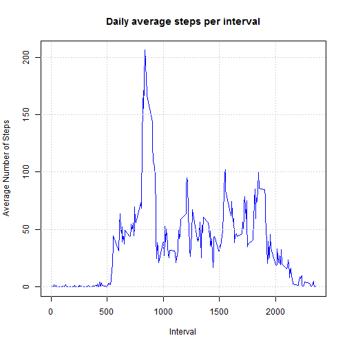

Reproducible Research Course Project 1
======================================

### 1. Loading and preprocessing the data

The data analysis performed in this assignament was collected using a personal activity monitoring device. This device collects data at 5 minute intervals through out the day. The data consists of two months of data from an   anonymous individual collected during the months of October and November, 2012 and include the number of steps taken in 5 minute intervals each day.

The raw data can be found here
[Activity.zip](https://d396qusza40orc.cloudfront.net/repdata%2Fdata%2Factivity.zip)

The variables included in this dataset are:

- **steps**: Number of steps taking in a 5-minute interval (missing values are coded as NA )  
- **date**: The date on which the measurement was taken in YYYY-MM-DD format  
- **interval**: Identifier for the 5-minute interval in which measurement was taken  
  

The code below is used to load the raw data into a data frame, it is assumed that the Activity.zip file was unzipped and placed in your current working directory before running. Summary and structure of the data frame is also shown below.


```r
df<-read.csv("activity.csv",header=TRUE,colClasses=c("integer","Date","integer"))
summary(df)
```

```
##      steps             date               interval     
##  Min.   :  0.00   Min.   :2012-10-01   Min.   :   0.0  
##  1st Qu.:  0.00   1st Qu.:2012-10-16   1st Qu.: 588.8  
##  Median :  0.00   Median :2012-10-31   Median :1177.5  
##  Mean   : 37.38   Mean   :2012-10-31   Mean   :1177.5  
##  3rd Qu.: 12.00   3rd Qu.:2012-11-15   3rd Qu.:1766.2  
##  Max.   :806.00   Max.   :2012-11-30   Max.   :2355.0  
##  NA's   :2304
```

```r
str(df)
```

```
## 'data.frame':	17568 obs. of  3 variables:
##  $ steps   : int  NA NA NA NA NA NA NA NA NA NA ...
##  $ date    : Date, format: "2012-10-01" "2012-10-01" ...
##  $ interval: int  0 5 10 15 20 25 30 35 40 45 ...
```

###2. What is mean total number of steps taken per day? (ignore the NA data)

The 2304 NA data in the *steps* column was removed from the data frame (df). The total number of steps per day was calculated using the aggregate function. A histogram with the frequency of total daily steps was created.


```r
#filter the NA data from the data frame

df.1<-na.omit(df)

#sum the steps taken per day

df.1_st<-aggregate(steps ~ date,df.1,sum)

#plot a histogram of the total steps per day

hist(df.1_st$steps,col="blue", 
        main="Total Steps per Day", 
        ylab="Frequency (Number of Days)", xlab="Steps", xlim=c(0,25000),breaks=25)

#add grid and box to the chart

grid(col="black")
box()
```


The mean and median of the total number of steps taken per day was calculated and reported.


```r
print(c("Mean of total number of steps taken per day:",round(mean(df.1_st$steps,na.rm=TRUE),2)))
```

```
## [1] "Mean of total number of steps taken per day:"
## [2] "10766.19"
```

```r
print(c("Median of total number of steps taken per day:", round(median(df.1_st$steps,na.rm=TRUE),2)))
```

```
## [1] "Median of total number of steps taken per day:"
## [2] "10765"
```


###2. What is the average daily activity pattern?


-  The average number of steps taken per interval (averaged across all days) was calculated using the aggregate function.

-  A time series plot of the 5-minute interval (x axis) and the average number of steps (y axis) was built.


```r
#average the steps by interval for all days

df.2_avg<-aggregate(steps ~ interval,df.1,mean)

#plot the chart

plot(df.2_avg$interval,df.2_avg$steps,type="l",col="blue", 
     main="Daily average steps per interval", 
     ylab="Average Number of Steps", xlab="Interval",
     cex.main=1.2,cex.axis=1,cex.lab=1)

grid()
```



Which 5-minute interval, on average across all the days in the dataset, contains the maximum number of steps?


```r
df.2_avg[df.2_avg$steps==max((df.2_avg$steps)),]
```

```
##     interval    steps
## 104      835 206.1698
```

###3. Imputing missing values

The total number of missing values in the dataset (i.e. the total number of rows with NA s) is shown in the summary table below. 


```r
summary(df)
```

```
##      steps             date               interval     
##  Min.   :  0.00   Min.   :2012-10-01   Min.   :   0.0  
##  1st Qu.:  0.00   1st Qu.:2012-10-16   1st Qu.: 588.8  
##  Median :  0.00   Median :2012-10-31   Median :1177.5  
##  Mean   : 37.38   Mean   :2012-10-31   Mean   :1177.5  
##  3rd Qu.: 12.00   3rd Qu.:2012-11-15   3rd Qu.:1766.2  
##  Max.   :806.00   Max.   :2012-11-30   Max.   :2355.0  
##  NA's   :2304
```

All missing values in the steps column in the dataset were filled in:

- The 5 minute interval missing values were substituted with the average number of steps taken per interval (averaged across all days), see chapter 2. (df.2_avg)

- The original dataframe (df) was merged together with the dataframe containing the average number of steps taken per interval (df.2_avg). The reference column used for merging was the *interval* column. The new dataframe contains 4 columns, the *steps.y* column contains average steps values for each interval.


```r
#merge the two dataframes

df.3<-merge(df,df.2_avg,by="interval")
str(df.3)
```

```
## 'data.frame':	17568 obs. of  4 variables:
##  $ interval: int  0 0 0 0 0 0 0 0 0 0 ...
##  $ steps.x : int  NA 0 0 0 0 0 0 0 0 0 ...
##  $ date    : Date, format: "2012-10-01" "2012-11-23" ...
##  $ steps.y : num  1.72 1.72 1.72 1.72 1.72 ...
```


- In the new dataframe the NA values in the *steps* column were filled in using the *steps.y* column.The new data frame was tidied up.


```r
#replace NA values

df.3$steps.x[is.na(df.3$steps.x)]<-df.3$steps.y[is.na(df.3$steps.x)]

#check there are no NAs value in data frame

sum(is.na(df.3))
```

```
## [1] 0
```

```r
#remove extra collumn with averages

df.3$steps.y<-NULL

#reanme steps column

names(df.3)[2]<-"steps_fill"
```

A histogram of the total number of steps taken each day was generated. Again the total number of steps per day was calculated using the aggregate function.


```r
#sum the steps taken per day

df.3_tot<-aggregate(steps_fill ~ date,df.3,sum)

#plot a histogram of the total steps per day

hist(df.3_tot$steps_fill,col="blue", 
     main="Total steps per day (NA values filled in)", 
     ylab="Frequency (Number of days)", xlab="steps", xlim=c(0,25000),breaks=25)

#add grid and box

grid(col="black")
box()
```


A new mean and median of the total number of steps taken per day was calculated and reported


```r
print(c("Mean of total number of steps taken per day (NA filled in):",round(mean(df.3_tot$steps,na.rm=TRUE),2)))
```

```
## [1] "Mean of total number of steps taken per day (NA filled in):"
## [2] "10766.19"
```

```r
print(c("Median of total number of steps taken per day (NA filled in):", round(median(df.3_tot$steps,na.rm=TRUE),2)))
```

```
## [1] "Median of total number of steps taken per day (NA filled in):"
## [2] "10766.19"
```


*The dataset with the NA values filled in shows the same mean value as in the old dataset. The median value increased from **10765.00** to **10766.19***

**What is the impact of imputing missing data on the estimates of the total daily number of steps?**

See tables below for the two data frames


```r
#old dataset
summary(df.1_st)
```

```
##       date                steps      
##  Min.   :2012-10-02   Min.   :   41  
##  1st Qu.:2012-10-16   1st Qu.: 8841  
##  Median :2012-10-29   Median :10765  
##  Mean   :2012-10-30   Mean   :10766  
##  3rd Qu.:2012-11-16   3rd Qu.:13294  
##  Max.   :2012-11-29   Max.   :21194
```

```r
#new dataset with NA values filled in
summary(df.3_tot)
```

```
##       date              steps_fill   
##  Min.   :2012-10-01   Min.   :   41  
##  1st Qu.:2012-10-16   1st Qu.: 9819  
##  Median :2012-10-31   Median :10766  
##  Mean   :2012-10-31   Mean   :10766  
##  3rd Qu.:2012-11-15   3rd Qu.:12811  
##  Max.   :2012-11-30   Max.   :21194
```

In this case there was little impact in filling the NA values as the NA values were filled in using the average for each interval.1st and 3rd quartile did change across the two data frames


###4. Are there differences in activity patterns between weekdays and weekends?

A new factor variable (wkd) was added to the dataframe. The factor variable has two levels, "weekday" and "weekend" indicating whether a given date is a weekday or weekend day.


```r
#create new factor column (wkd) with name of days (Monday to Sunday)

df.3$wkd<-weekdays(df.3$date)

#create vectors for name change from days to weekday and weekend

a<-c("Monday","Tuesday","Wednesday","Thursday","Friday","Saturday","Sunday")
b<-c("Weekday","Weekday","Weekday","Weekday","Weekday","Weekend","Weekend")

for (i in 1:length(a)){

df.3$wkd<-mapply(gsub,a[i],b[i],df.3$wkd)}

#check new column

str(df.3$wkd)
```

```
##  chr [1:17568] "Weekday" "Weekday" "Weekend" "Weekday" ...
```

Time-series plots for the 5-minute interval vs the average number of steps taken averaged across all **weekday days** or **weekend days** was generated.


```r
#average the steps over the intervals by weekday/weekend

df.4<-aggregate(steps_fill ~ wkd+interval,df.3,mean)

library(ggplot2)
```

```
## Warning: package 'ggplot2' was built under R version 3.2.3
```

```r
df.4$wkd<-as.factor(df.4$wkd)

g <- ggplot(df.4, aes(x=interval, y=steps_fill, color = wkd)) +
  geom_line() +
  facet_wrap(~ wkd,nrow=2,ncol=1)+
  labs(x="interval")+
  labs(y="steps")+
  ggtitle("Average Steps Over 5 Minute Intervals - Weekdays And Weekends")
print(g)
```


